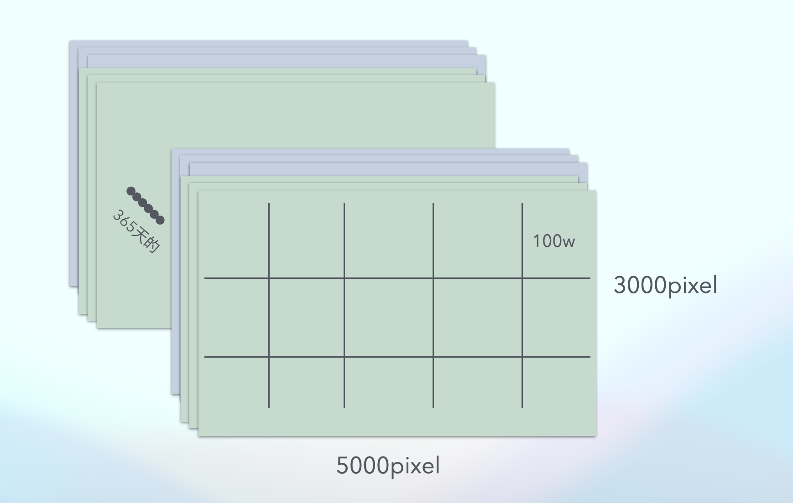

## 优化案例

1. 在matlib中优化计算量。
背景：
读博士的朋友找到我让我帮她跑一个matlib程序。她说她跑了几天这个程序没跑完。我拿到程序。

一个读取365天的地图三张地图的数据，这个数据大概50G大小。这个程序从365天，每天三张地图中读取数据合成一张数据地图。每张图大概是3000x5000像素点。

第一次拿到这个matlib数据
实现很简单，
```

```


我仔细分析原始代码，其中的计算并不复杂，并不应该耗费太多时间。那么耗时间，就是文件IO的问题。最后仔细分析，发现每次生成一个像素点，都需要打开关闭365*3次文件，计算一张图需要3000x5000个像素点，然后就需要365*3*3000*5000=1.6亿次打开文件IO的操作。  
找到优化点之后，为了尽快减少IO打开关闭等系统调用，我觉得可以充分利用每次打开一个文件的操作。就是我可以读取一整块pixel，不读取一个pixel。
这样子把一张图切分成1000

其中我需要考虑到我内存的大小，16G，内存8G可用，那么8*365*3*X=8G，求出X就是一次可以载入多少pixel。
然后计算出X～= 100w Pixel，原图3000x5000=1500w，所以原图我可以划分成3x5块。
那么我每次读取一张图的100w个pixel一次性计算。我可以减少IO到365*3*15次。优化了IO次数6个数量级。
最终我跑完整个数据只用了30min。

优化后代码如下：

```
```


2. 