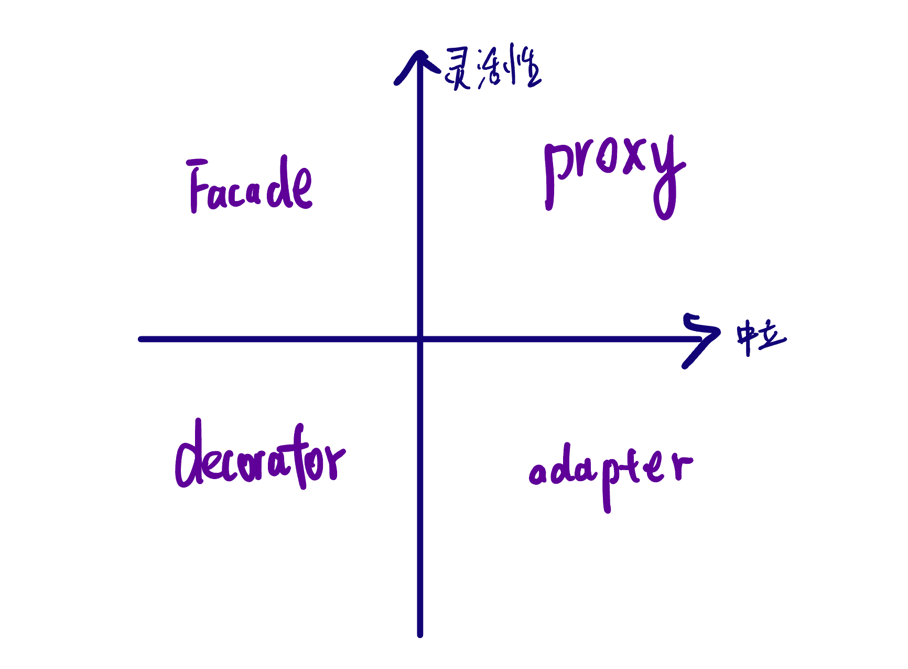

#### 另一种学习设计模式的视角


在常见的设计模式中，我们都是按照业务来看待设计模式。我们也可以从人员管理的角度来看待设计模式。
那么可以把设计模式分为四类，都可以在现实中找到对应的例子。这里面甚至都没有软件设计的例子。甚至我们再抽象一下，这些例子都适用于集团公司部门之间的协作模式。把这里面的人，换做集团部门之类的都能适用。


多人协作
这种就是讲多个人怎么协作起来。这里面的人你可以理解为一个对象（Object）。如何组织一群人协作起来，按照有序的维度或者说人与人之间耦合程度来区分。
```mermaid
Composition --> Strategy --> ChainOfResponsebilty

```
单人工作模式
单人工作模式可以我们可以使用Command模式，当然单人的工作也会根据不一样的任务切换不同状态，比如工作是工作状态，人回家是回家模式，担任家庭角色。
访问模式
这种模式我觉得更多的是一种多人协作模式特例。可以在公司内部我们可以看到审查人员，项目管理人员，这些人，都需要知道项目或者每个节点的情况。但是监督或者查看多人状态，我们实际上就是访问他们的。
那么根据访问对象的灵活性我们可以排序。
```
Observer --> Visitor --> iterator
```

Iterator模式更多只能访问数据类型一致的数据，或者有一定顺序或者关联的。
Visitor双方都像是要有一定的暗语才能访问彼此。
Observer只需要一方固定开发，每个人都能去访问。这样看，实际上Observer更灵活多样。当然我们也可以结合这些模式玩出花来。


中间人模式
在现实生活中，我们经常需要中间人来介绍，现实中婚介所，社交平台，购物，外卖平台。都是中间人模式的延伸。在经济学上，这种平台可以降低交易成本。
中间人模式，这四种模式，可以根据两个维度来划分其适用范围。第一个维度，中立与否，第二个维度，灵活性。   



什么时候我们需要引入中间人？
当我们需要更多选择时我们会引入灵活性更强的proxy这种模式的中间人。当我们知道某样东西最好，或者提高交换效率。就比方说，我们喜欢吃某样零食，在超市中看到。我们经常吃，那么就想拿到最低的价格，那么就有工厂店这种产物。

